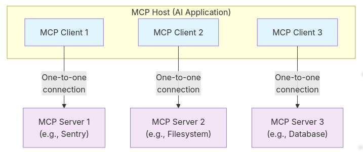

MCP官方文档[https://modelcontextprotocol.io/docs/getting-started/intro](https://modelcontextprotocol.io/docs/getting-started/intro)

MCP是一个将AI应用程序连接到外部系统的开放标准协议。

使用MCP，诸如Claude或Chatgpt之类的AI应用程序可以连接到数据源（例如本地文件，数据库）、工具（例如搜索引擎，计算器）和工作流程（例如专业提示），访问使用它们的关键信息并执行任务。

将MCP视为AI应用程序的USB-C端口。正如USB-C提供了连接电子设备的标准化方式一样，MCP也提供了一种将AI应用程序连接到外部系统的标准化方法。

## MCP核心概念

### 参与者

MCP遵循客户端服务器体系结构，其中MCP主机（例如Claude Code或Claude Desktop）建立了与一个或多个MCP服务器的连接。 MCP主机通过为每个MCP服务器创建一个MCP客户端来实现这一目标。每个MCP客户端都与其相应的MCP服务器保持专用的一对一连接。

MCP体系结构的主要参与者是：

- **MCP主机**：协调和管理一个或多个MCP客户的AI应用程序

- **MCP客户端**：维护与MCP服务器连接并从MCP服务器获取上下文的组件供MCP主机使用

- **MCP服务器**：为MCP客户端提供上下文的程序

### 层

MCP由两层组成：

- **数据层**：定义用于客户端服务器通信的基于JSON-RPC的协议，包括生命周期管理以及核心原始词，例如工具，资源，提示和通知。

- **传输层**：定义可以在客户和服务器之间进行数据交换的通信机制和渠道，包括特定于传输的连接建立，消息框架和授权。

从概念上讲，数据层是内层，而传输层是外层。

#### 数据层

数据层实现了基于JSON-RPC 2.0的交换协议，该协议定义了消息结构和语义。该层包括：

- **生命周期管理**：处理客户和服务器之间的连接初始化，能力谈判和连接终止

- **服务器功能**：使服务器能够提供核心功能，包括用于AI操作的工具，上下文数据的资源以及来自客户端的交互模板的提示

- **客户端功能**：使服务器可以要求客户从主机LLM采样，从用户中引起输入，并将消息记录到客户端

- **实用程序功能**：支持其他功能，例如实时更新通知和长期运行的进度跟踪

#### 传输层

传输层管理客户和服务器之间的通信渠道和身份验证。它处理连接建立，消息框架以及MCP参与者之间的安全通信。

MCP支持两种传输机制：

- **STDIO**：使用标准输入/输出流进行同一机器上本地进程之间的直接过程通信，从而提供最佳性能，而没有网络开销。

- **流式HTTP**：使用HTTP POST将带有可选的服务器式事件的客户端到服务器消息用于流式传输功能。该传输启用远程服务器通信并支持标准的HTTP身份验证方法，包括携带者token，API key和自定义header。 MCP建议使用OAuth获得身份验证令牌。

传输层从协议层中抽象通信详细信息，从而使所有传输机制都具有相同的JSON-RPC 2.0消息格式。
