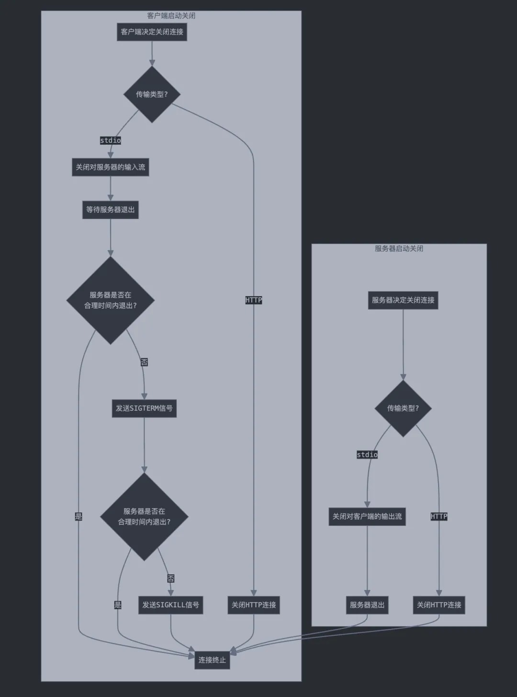

文章来自[https://mp.weixin.qq.com/s/lJHiT-iaecqhcR55fz4G1Q](https://mp.weixin.qq.com/s/lJHiT-iaecqhcR55fz4G1Q)

MCP 协议定义了一个严格的生命周期，用于客户端-服务器连接，确保了通信双方能进行适当的状态管理和能力协商。

MCP 连接生命周期主要分为三个阶段：

1. **初始化阶段**：客户端与服务器进行协议版本协商和能力协商。
    
2. **操作阶段**：客户端与服务器按照协议正常通信，交换消息。
    
3. **关闭阶段**：客户端与服务器各自优雅的终止连接。
    

MCP 连接生命周期通信示例：


## 建立链接

MCP 协议定义的客户端与服务器建立连接的过程，跟 TCP 协议的三次握手过程有点类似。

1. 客户端给服务器发送请求，要求建立连接
    
2. 服务器给客户端发送响应，告知连接可以建立
    
3. 客户端给服务器发送通知，告知连接已建立
    

TCP 三次握手通信示例：


### 初始化

MCP 协议中，客户端与服务器建立连接的阶段，叫做初始化（Initialization）

初始化阶段必须是客户端和服务器之间的第一次交互。在此阶段，客户端和服务器：

- 协商通信使用的协议版本
    
- 交换和协商功能
    
- 分享实现细节
    

客户端必须通过发送包含以下内容的初始化请求来启动此阶段：

- 支持的协议版本
    
- 客户端功能
    
- 客户端实现信息
    

客户端请求建立连接的消息示例：

```json
{
	"method": "initialize",
	"params": {
		"protocolVersion": "2024-11-05",
		"capabilities": {},
		"clientInfo": {
			"name": "mcp-client-claude",
			"version": "0.1.0"
		}
	},
	"jsonrpc": "2.0",
	"id": 0
}
```

初始化请求需要发送的是单条 JSON-RPC 消息，而不应该是批处理的 JSON-RPC 消息，因为批处理消息在初始化完成之前，服务器是无法处理的。

服务器在接到客户端的初始化请求之后，必须用单条 JSON-RPC 消息响应其自身的能力和信息。

服务器接到建立连接请求后的响应消息示例：

```json
{
	"jsonrpc": "2.0",
	"id": 0,
	"result": {
		"protocolVersion": "2024-11-05",
		"capabilities": {
			"experimental": {},
			"tools": {
				"listChanged": false 
			}
		},
		"serverInfo": {
			"name": "mcp-server-time",
			"version": "1.6.0"
		}
	}
}
```

初始化成功后，客户端必须发送一个已初始化通知，以表明它已准备好开始正常操作。

客户端发送的已初始化通知消息示例：

```JSON
{
	"method": "notifications/initialized",
	"jsonrpc": "2.0"
}
```

- 客户端在服务器对初始化请求做出响应之前，不应发送除 ping 之外的其他请求。
    
- 服务器在接收到初始化通知之前，不应发送除 ping 和日志记录之外的其他请求。
    

### 版本协商

在初始化请求中，客户端必须发送它支持的协议版本。这应该是客户端支持的最新版本。

- 如果服务器支持请求的协议版本，它必须以相同版本响应。否则，服务器必须以它支持的另一个协议版本响应。这应该是服务器支持的最新版本。
    
- 如果客户端不支持服务器响应中的版本，它应该断开连接。
    

比如，客户端在初始化请求消息中，给服务器发送的，自己支持的最新版本为：

```JSON
{
	"method": "initialize",
	"params": {
		"protocolVersion": "2024-11-05",
		"clientInfo": {
			"name": "mcp-client-claude",
			"version": "0.1.0"
		}
		// ...
	},
	"jsonrpc": "2.0",
	"id": 0
}
```

此版本的 MCP 协议仅支持 stdio 和 SSE 两种传输机制，不支持 Streamable HTTP 传输。

如果服务器是基于 stdio 和 SSE 传输实现的，服务器可以给客户端返回相同的协议版本，表示支持按照此版本跟客户端通信：

```JSON
{
	"jsonrpc": "2.0",
	"id": 0,
	"result": {
		"protocolVersion": "2024-11-05",
		"serverInfo": {
			"name": "mcp-server-time",
			"version": "1.6.0"
		}
		// ...
	}
	// ...
}
```

如果服务器按照后来的协议版本：`2025-03-26` 进行了升级，支持了 Streamable HTTP 传输，但是考虑到客户端并不支持此传输机制。所以服务器应该给客户端返回自己最新支持的协议版本：

```JSON
{
	"jsonrpc": "2.0",
	"id": 0,
	"result": {
		"protocolVersion": "2025-03-26",
		"serverInfo": {
			"name": "mcp-server-time", 
			"version": "1.6.0"
		}
		// ...
	}
	// ...
}
```

客户端在接到服务器返回的版本之后，知道自身并不支持此协议版本约定的一些能力。所以应该主动断开连接，不再与服务器通信。直到升级了自身支持的协议版本后，再与服务器重新建立连接。

### 能力协商

客户端与服务器在初始化阶段，通过能力协商确定会话期间将用到哪些能力。

客户端与服务器支持的能力包括：

|分类|能力|描述|
|---|---|---|
|客户端|`roots`|提供文件系统访问能力|
|客户端|`sampling`|支持 LLM 采样相关请求|
|客户端|`experimental`|描述对非标准实验性功能的支持|
|服务端|`prompts`|提供提示词模板服务|
|服务端|`resources`|提供可读资源|
|服务端|`tools`|暴露可调用工具|
|服务端|`logging`|输出结构化日志消息|
|服务端|`experimental`|描述对非标准实验性功能的支持|

能力对象可以包含子能力，例如：

- listChanged：支持列表变更通知（用于提示、资源和工具）
    
- subscribe：支持订阅单个项目的变更（仅限资源）
    

比如，一个功能实现完备的 MCP 客户端，在初始化阶段，应该发送自己的完整能力：

```JSON
{
	"jsonrpc": "2.0",
	"id": 1,
	"method": "initialize",
	"params": {
		"protocolVersion": "2024-11-05",
		"capabilities": {
			"roots": {
				"listChanged": true
			},
			"sampling": {}
		},
		"clientInfo": {
			"name": "mcp-client-example",
			"version": "1.0.0"
		}
	}
}
```

一个功能实现完备的 MCP 服务器，在初始化阶段也应该响应自己的完整能力：

```JSON
{
	"jsonrpc": "2.0",
	"id": 1,
	"result": {
		"protocolVersion": "2024-11-05",
		"capabilities": {
			"logging": {},
			"prompts": {
				"listChanged": true
			},
			"resources": {
				"subscribe": true,
				"listChanged": true
			},
			"tools": {
				"listChanged": true
			}
		},
		"serverInfo": {
			"name": "mcp-server-example",
			"version": "1.0.0"
		},
		"instructions": "Optional instructions for the client"
	}
}
```

## 消息通信

MCP 客户端与 MCP 服务器建立连接之后，开始正常通信，交换消息。这个阶段称为操作（Operation）

在操作阶段，客户端和服务器根据协商的能力交换消息。

通信双方应该：

- 尊重协商的协议版本
    
- 仅使用成功协商的能力
    

比如，在初始化阶段，客户端与服务器进行能力协商，服务器告知客户端自己支持工具（Tools）相关的能力：

```JSON
{
	"capabilities": {
		"experimental": {},
		"tools": {
			"listChanged": false
		}
	}
}
```

客户端根据自身的需求，请求服务器能力范围内的资源。

### 获取工具列表

比如，MCP 客户端跟 MCP 服务器建立连接之后，知道服务器实现了 `tools` 能力。

接下来，客户端可以给服务器发送一个获取服务器工具列表（Tools）的请求：

```JSON
{
	"method": "tools/list",
	"params": {},
	"jsonrpc": "2.0",
	"id": 1
}
```

服务器接到请求后，给客户端返回服务器内部定义的工具列表：

```JSON
{
	"jsonrpc": "2.0",
	"id": 1,
	"result": {
		"tools": [
		{
			"name": "get_current_time",
			"description": "Get current time in a specific timezones", 
			"inputSchema": {
				"type": "object",
				"properties": {
					"timezone": {
						"type": "string", 
						"description": "IANA timezone name (e.g., 'America/New_York', 'Europe/London'). Use 'Asia/Shanghai' as local timezone if no timezone provided by the user."
					}
				},
				"required": ["timezone"]
			}
		},
		{
			"name": "convert_time",
			"description": "Convert time between timezones",
			"inputSchema": {
				"type": "object", 
				"properties": {
					"source_timezone": {  
						"type": "string",    
						"description": "Source IANA timezone name (e.g., 'America/New_York', 'Europe/London'). Use 'Asia/Shanghai' as local timezone if no source timezone provided by the user."  
					},
					"time": {       
						"type": "string",    
						"description": "Time to convert in 24-hour format (HH:MM)"
					},
					"target_timezone": { 
						"type": "string",    
						"description": "Target IANA timezone name (e.g., 'Asia/Tokyo', 'America/San_Francisco'). Use 'Asia/Shanghai' as local timezone if no target timezone provided by the user."  
					}    
				},
				"required": ["source_timezone", "time", "target_timezone"]
			}
		}]
	}
}
```

### 调用工具

大模型客户端（主机 Host）通过大模型的规划调度能力，从服务器支持的工具列表中，选择需要调用的工具，并解析参数。

大模型客户端通过 MCP 客户端发起到 MCP 服务器进程的调用工具请求。

调用工具请求示例：

```JSON
{
	"method": "tools/call",
	"params": {
		"name": "get_current_time",
		"arguments": {
			"timezone": "America/Los_Angeles"
		}
	},
	"jsonrpc": "2.0",
	"id": 2
}
```

MCP 服务器根据请求的工具名：`request.params.name`，执行工具内部的业务逻辑，返回工具调用结果：

```JSON
{
	"jsonrpc": "2.0",
	"id": 2,
	"result": {
		"content": [
		{
			"type": "text",
			"text": "{\n  \"timezone\": \"America/Los_Angeles\",\n  \"datetime\": \"2025-04-07T00:30:23-07:00\",\n  \"is_dst\": true\n}"         
		}],
		"isError": false
	}
}
```

MCP 客户端收到 MCP 服务器的工具调用结果，控制权移交给主进程，由主进程请求大模型做总结输出。

### 请求其他资源

目前大部分的 MCP 服务器实现的都是 `tools` 能力。除此之外，也可能会实现其他几种能力，在与客户端建立连接，能力协商阶段，明确返回给客户端自身实现的所有能力：

```JSON
{
	"jsonrpc": "2.0",
	"id": 1,
	"result": {
		"protocolVersion": "2024-11-05",
		"capabilities": {
			"logging": {},
			"prompts": {  
				"listChanged": true
			},
			"resources": {
				"subscribe": true,
				"listChanged": true
			},
			"tools": {
				"listChanged": true
			}
		},
		"serverInfo": {
			"name": "mcp-server-example",
			"version": "1.0.0"
		}
	}
}
```

MCP 客户端在操作阶段，可以给 MCP 服务器发送不同方法（method）的请求，来调用 MCP 服务器实现的各种能力。

- MCP 客户端请求 MCP 服务器获取资源列表：
    

```JSON
{
	"method": "resources/list",
	"params": {},
	"jsonrpc": "2.0",
	"id": 63
}
```

- MCP 客户端请求 MCP 服务器获取某个资源
    

```JSON
{
	"jsonrpc": "2.0",
	"id": 21,
	"method": "resources/read",
	"params": {
		"uri": "file:///project/src/main.rs"
	}
}
```

- MCP 客户端请求 MCP 服务器获取提示词列表：
    

```JSON
{
	"method": "prompts/list",
	"params": {},
	"jsonrpc": "2.0",
	"id": 182
}
```

- MCP 客户端请求 MCP 服务器获取某个提示词
    

```JSON
{     
	"jsonrpc": "2.0",
	"id": 51,
	"method": "prompts/get",
	"params": {
		"name": "code_review",
		"arguments": {
			"code": "def hello():\n    print('world')"
		}
	}
}
```

## 断开连接

MCP 服务器与 MCP 客户端断开连接阶段，称为关闭（Shutdown）

在关闭阶段，一方（通常是客户端）主动终止连接。

相反，因为对方提前关闭而无法继续通信的一方（通常是服务器），应使用底层传输机制来终止连接：

- **stdio**
    

对于 stdio 传输，MCP 客户端应通过以下方式启动关闭流程：

1. 首先，关闭对子进程的输入流（MCP 服务器的 stdin）
    
2. 等待服务器退出，或者当服务器未在合理时间内退出时发送 SIGTERM 信号
    
3. 如果在给服务器发送 SIGTERM 后，服务器合理时间内仍未退出，则继续给服务器发送 SIGKILL 信号
    

MCP 服务器通过关闭对客户端的输出流（stdout）来完成关闭流程。

- **HTTP**
    

对于 HTTP 传输，关闭阶段通过关闭相关的 HTTP 连接来断开 MCP 客户端与 MCP 服务器的连接。底层对应着 TCP 的四次挥手机制。

MCP 客户端与 MCP 服务器断开连接的流程示例：



## 超时机制

MCP 协议实现方应为所有发送的请求设置超时，以防止连接挂起和资源耗尽。当请求在超时期间未收到成功响应或收到错误响应时，发送者应发出对该请求的取消通知并停止等待响应。

SDK 和其他中间件应支持为请求配置超时。

MCP 协议实现方可以选择在接收到对应请求的进度通知时重置超时计时器，这表明工作实际上正在进行。然而，应始终强制执行最大超时，无论进度通知如何，以降低不守规矩的一方对通信双方造成的影响。

请求超时，客户端取消请求通知示例：

```JSON
{
	"jsonrpc": "2.0",
	"method": "notifications/cancelled",
	"params": {
		"requestId": 2,
		"reason": "Error: MCP error -32001: Request timed out"
	}
}
```

## 错误处理

MCP 协议实现方应准备处理以下错误情况：

- 协议版本不匹配
    
- 无法协商所需功能
    
- 请求超时
    

协议不支持错误示例：

```JSON
{
	"jsonrpc": "2.0",
	"id": 1,
	"error": {
		"code": -32602,
		"message": "Unsupported protocol version",
		"data": {
			"supported": ["2024-11-05"],
			"requested": "1.0.0"
		}
	}
}
```

服务端处理错误示例：

```JSON
{
	"jsonrpc": "2.0",
	"id": 0,
	"error": {
		"code": -32603,
		"message": "Proxy error: Failed to parse URL"
	}
}
```

## 完整交互示例

从用户使用大模型客户端的视角，梳理一下 MCP 客户端与 MCP 服务器的连接生命周期内的完整交互流程：

- 用户启动客户端
    

客户端发送建立连接请求

```JSON
{
	"method": "initialize",
	"params": {
		"protocolVersion": "2024-11-05",
		"capabilities": {},
		"clientInfo": {
			"name": "claude-ai",
			"version": "0.1.0"  
		}
	},
	"jsonrpc": "2.0",
	"id": 0
}
```

服务器响应连接请求

```JSON
{
	"jsonrpc": "2.0",
	"id": 0,
	"result": {
		"protocolVersion": "2024-11-05",
		"capabilities": {
			"experimental": {},
			"tools": {
				"listChanged": false
			}
		},
		"serverInfo": {
			"name": "mcp-time",
			"version": "1.6.0"
		}
	}
}
```

客户端发送连接已建立通知

```JSON
{
	"method": "notifications/initialized",
	"jsonrpc": "2.0"
}
```

客户端发送获取服务器工具列表请求

```JSON
{
	"method": "tools/list",
	"params": {},
	"jsonrpc": "2.0",
	"id": 2
}
```

服务器响应客户端可用的工具列表

```JSON
{
	"jsonrpc": "2.0",
	"id": 2,
	"result": {
		"tools": [
		{
			"name": "get_current_time",    
			"description": "Get current time in a specific timezones",     
			"inputSchema": {
				"type": "object",
				"properties": { 
					"timezone": {
						"type": "string", 
						"description": "IANA timezone name (e.g., 'America/New_York', 'Europe/London'). Use 'Asia/Shanghai' as local timezone if no timezone provided by the user."
					}
				},
				"required": ["timezone"]  
			}
		},
		{
			"name": "convert_time",
			"description": "Convert time between timezones",
			"inputSchema": {
				"type": "object",
				"properties": { 
					"source_timezone": {
						"type": "string", 
						"description": "Source IANA timezone name (e.g., 'America/New_York', 'Europe/London'). Use 'Asia/Shanghai' as local timezone if no source timezone provided by the user."
					},
					"time": {
						"type": "string",
						"description": "Time to convert in 24-hour format (HH:MM)" 
					},
					"target_timezone": {   
						"type": "string",       
						"description": "Target IANA timezone name (e.g., 'Asia/Tokyo', 'America/San_Francisco'). Use 'Asia/Shanghai' as local timezone if no target timezone provided by the user."
					}
				},
				"required": ["source_timezone", "time", "target_timezone"]
			}
		}]
	}
}
```

- 用户发送消息时
    

客户端发送调用工具请求

```JSON
{
	"method": "tools/call",
	"params": {
		"name": "get_current_time",
		"arguments": {
			"timezone": "America/Los_Angeles"
		}
	},
	"jsonrpc": "2.0",
	"id": 110
}
```

服务器响应调用工具结果

```JSON
{
	"jsonrpc": "2.0",
	"id": 110,
	"result": {
		"content": [
		{
			"type": "text",
			"text": "{\n  \"timezone\": \"America/Los_Angeles\",\n  \"datetime\": \"2025-04-07T01:39:34-07:00\",\n  \"is_dst\": true\n}"         
		}],
		"isError": false
	}
}
```

- 用户关闭客户端
    

传输层（stdio 或 http）断开，客户端与服务器终止通信， 双方各自关闭连接。

MCP 客户端与 MCP 服务器在连接生命周期内完整的交互示例：


## 总结

MCP 协议定义了一个严格的三阶段生命周期，用于管理客户端-服务器连接：

**初始化阶段**

- 客户端发起连接请求，发送协议版本、能力和实现信息
    
- 服务器响应自身支持的协议版本和能力
    
- 客户端发送初始化完成通知
    
- 双方进行协议版本协商和能力协商
    
- 支持的能力包括：roots、sampling、prompts、resources、tools、logging 等
    

**操作阶段**

- 双方根据协商的能力进行正常通信
    
- 客户端可以请求服务器提供的各种资源和服务
    
- 主要操作包括：
    
	-  获取工具列表
    
	- 调用工具
    
	- 获取资源列表和内容
    
	- 获取提示词列表和内容
    

**关闭阶段**

- 客户端主动终止连接
    
- 对于 stdio 传输：
    

	- 关闭服务器输入流
    
	- 等待服务器退出或发送终止信号
    

- 对于 HTTP 传输：
    

	- 通过关闭 HTTP 连接完成断开
    

**其他重要机制**

- 超时机制：为请求设置超时，防止连接挂起
    
- 错误处理：处理协议版本不匹配、能力协商失败等错误情况
    
- 完整的交互流程包括：建立连接、能力协商、资源请求、工具调用等步骤
    

这个生命周期设计确保了 MCP 客户端和 MCP 服务器之间能够进行可靠、有序的通信，同时提供了灵活的能力扩展机制。
