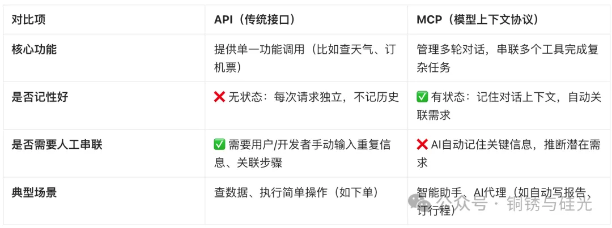
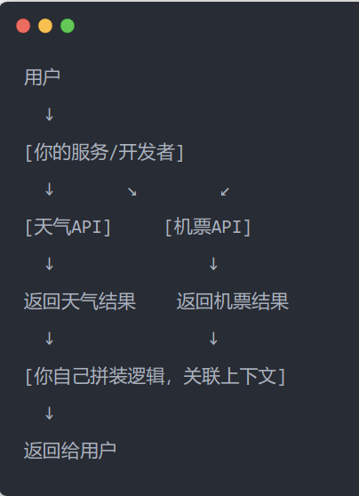
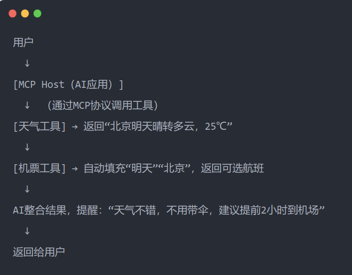
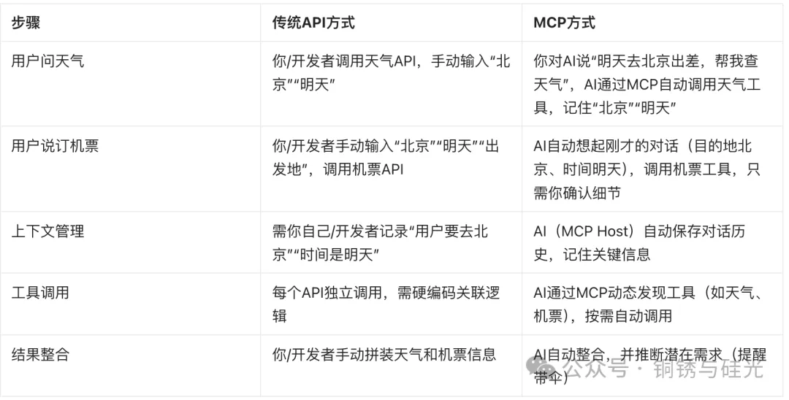

文章来自[https://mp.weixin.qq.com/s/AgD1BdvvnJxRQfQCPfmVeg?poc_token=HEf8yGijCx86IwEyJNf4GS226dDbq2I2NN4npoM7](https://mp.weixin.qq.com/s/AgD1BdvvnJxRQfQCPfmVeg?poc_token=HEf8yGijCx86IwEyJNf4GS226dDbq2I2NN4npoM7)

## 这篇文章能给你带来什么？

> - 看到最生活化的MCP专业讲解
>     
> - 一下子就明白MCP为啥不干脆就叫API？
>     
> - AIAgent的架构到底长什么样的？
>     
> - 为啥AI智能体常常和MCP成对出现？
>     
> - 看完你都可以立马去给别人科普，不行来随时找我！
>     

## 一、为什么99%的人都没搞懂MCP？因为没人像我这样，说人话跟你讲！

你肯定刷到过“MCP”这个词（比如AI圈热议的Model Context Protocol），但大概率和我一开始一样：满脑子问号——“这不就是给AI用的API吗？干脆就叫API不就得了，拽什么新词儿装什么神秘？网上那些解释要么云里雾里，要么把MCP和API混为一谈，根本没说清区别！”

更气人的是，技术博主们要么照搬官方文档念术语，要么简单说“MCP是管理上下文的”，**可到底怎么管理？它具体是怎么工作的？凭啥它不直接叫AI的API？** 这些关键问题，没一个讲透的！

今天这篇，我就偏要，用你绝对能听懂的生活例子+真实流程图/表格，彻底讲明白MCP到底是什么？包含哪些东西——**用真正说人话的逻辑讲清楚，看完你都可以立马去给别人科普成功，不行随时来找我！**

## 二、先搞懂基础概念：什么叫“有状态”和“无状态”？（用人话解释）

在讲MCP和API之前，先理解两个关键术语：

- **无状态（Stateless）**：就像你每次去便利店买饮料，店员不会记得你昨天买了什么——每次交易都是独立的，只处理当下请求。
    
- **有状态（Stateful）**：就像你常去的咖啡店，店员记得你上周点过美式加糖，今天直接问：“老样子，还是美式加糖？”——他会记住你的偏好和历史。
    

对应到技术：

- **API（传统接口）**通常是“无状态”的——你每次调用它（比如查天气），都得把所有信息（城市、日期）重新说一遍，它不会自动记住你上次的请求。
    
- **MCP（模型上下文协议）**则是“有状态”的——它像一个贴心的记录员，会把你们之前的对话、你的需求、用过的工具都记下来，下次交互时直接“想起来”。
    
      
    

## 三、生活比喻：API像“外卖APP”，MCP像“智能管家”

为了更直观，我们用两个常见事物类比：

### 1. API：像“外卖APP”（功能独立，但需你亲力亲为）

你要吃一顿饭：

- 打开外卖APP，手动输入“北京”“明天”“川菜”，查天气；
    
- 切换到另一个APP，手动输入“明天”“北京”“机票”，选航班；
    
- 自己把“天气适合吃辣”和“机票已订”关联起来，决定带不带伞。
    

每个APP（查天气、订机票）是独立的“API”——它们提供特定功能，但**不会主动关联需求，也不会记住你的历史操作**。

### 2. MCP：像“智能管家”（懂需求，自动串联一切）

你对管家说：“明天去北京出差，帮我查天气。”

- 管家查完天气，记住“目的地：北京”“时间：明天”；
    
- 你接着说：“那帮我订张机票吧。” 管家立刻想起刚才的对话，直接调出机票信息，还提醒：“天气不错，不用带伞，但建议提前2小时到机场。”
    

管家（MCP）不仅调用工具（查天气、订机票），还会**自动记住上下文，推断你的潜在需求**——这才是AI该有的“智能感”。

  

## 四、为什么MCP不直接叫API？因为目标完全不同！（详细对比表格）

你可能想问：“MCP听起来就是给AI用的API啊，为啥不直接叫‘AI-API’？”

答案：**因为两者的核心目标不同，而且MCP比API大一些**；

简单说：**API是“一次性工具”，用完就扔；MCP是“长期伙伴”，陪你聊完整个任务，还能帮你记住重点**。

  

## 五、真实例子对比，一下子你就明白了：查天气+订机票，MCP和API分别怎么处理？（附核心流程图+表格）

我们用具体场景对比，再配上**流程图和表格**，帮你更直观看懂差异。

> **▶ 场景：用户说“明天去北京出差，帮我查天气，再订张机票”**

### 1. 传统API的处理流程（需手动串联）

**核心流程图（文字版）**：

**关键问题**：

- 每次调用API都要手动输入信息（比如城市、日期）；
    
- 系统不会自动关联“查天气”和“订机票”是同一个任务；
    
- 开发者得写代码管理上下文，普通用户根本感知不到。
    

### 2. MCP的处理流程（AI自动管理）

**核心流程图（文字版）**：

**详细对比表格**：

核心区别：**MCP让AI自己记住了“北京”“明天”，自动关联需求，甚至能推断你的潜在问题——这才是“智能”的感觉**。

  

## 六、一切的真相：MCP到底是什么？真的不是API老瓶装新酒

简单来说，MCP不是简单的“接口”，而是一整套**规范体系**，包含两个核心部分：

### 1. 实现方案推荐（MCP Host：智能体应用本体）

这是实际运行在AI应用里的程序（比如Claude Desktop、某个AI助手插件），它扮演着“MCP Host”的角色——就像智能管家的“大脑”。功能包括：

- 封装大模型（比如Claude、GPT），负责和你对话；
    
- 管理上下文（记住多轮对话、你的偏好、当前任务）；
    
- 当你需要调用外部工具（比如查天气、订机票）时，它通过MCP协议和工具沟通，并整合结果。 👉 本质是一个“应用服务”，通常需要开发者根据MCP规范自己实现（比如开发AI助手插件）。
    

### 2. 明确协议（MCP Registry：工具注册与发现的全球标准）

这是MCP最核心的“语言规范”——规定了AI和工具之间“怎么说话”“怎么发现对方”“怎么传递信息”。包括：

- **工具注册**：每个工具（如天气API、订票系统）必须按MCP标准，公开功能描述（比如“我能查天气，需要输入城市和日期”）、参数格式；
    
- **工具发现**：AI可以通过MCP协议，自动询问“有哪些工具可用”，并获取详细信息；
    
- **通信规则**：使用JSON-RPC 2.0格式，通过Stdio（本地）或SSE（远程）传输。
    

👉 这是全球统一的规范（由Anthropic公司提出），所有遵循MCP的工具和AI应用都必须按这个标准来——就像USB-C接口全球通用一样：

> （协议引用：MCP基于JSON-RPC 2.0，工具发现通过list_tools方法实现，参数和返回值遵循JSON Schema，传输支持Stdio和SSE——具体见Anthropic官方文档。）

### 对比API：

_**API通常只包含“被调用端的字段定义”（比如某个天气API规**__**定“city字段必须是字符串”），是具体功能的术语统称，没有上下文管理、工具动态发现等能力。**_

## 终于有人把MCP是个啥给讲透了！

下次再听到“MCP”，你不用再懵圈——它不是API的“马甲”，而是让AI真正“懂人话”的一套**标准体系**，我们常说的**MCP协议，其实只是MCP的一部分而已。真正的MCP，体系更加丰富庞大**。

现在市面上，非常多的AI博主，其实都不是技术出身；

我之前也看了很多关于MCP到底是什么的解释，但没有一个人把它为什么不干脆就叫API讲清楚过。**他们绝大多数都只是照搬MCP本身是什么的概念，却不懂从整体技术进程的角度去帮助大家区分理解**。

今天我干脆自己写，用这篇生活例子+真实流程图，把MCP和API的区别、MCP的实现原理，完完整整拆给你看。

收藏这篇，下次给朋友科普AI，你绝对就是最专业的那个。
